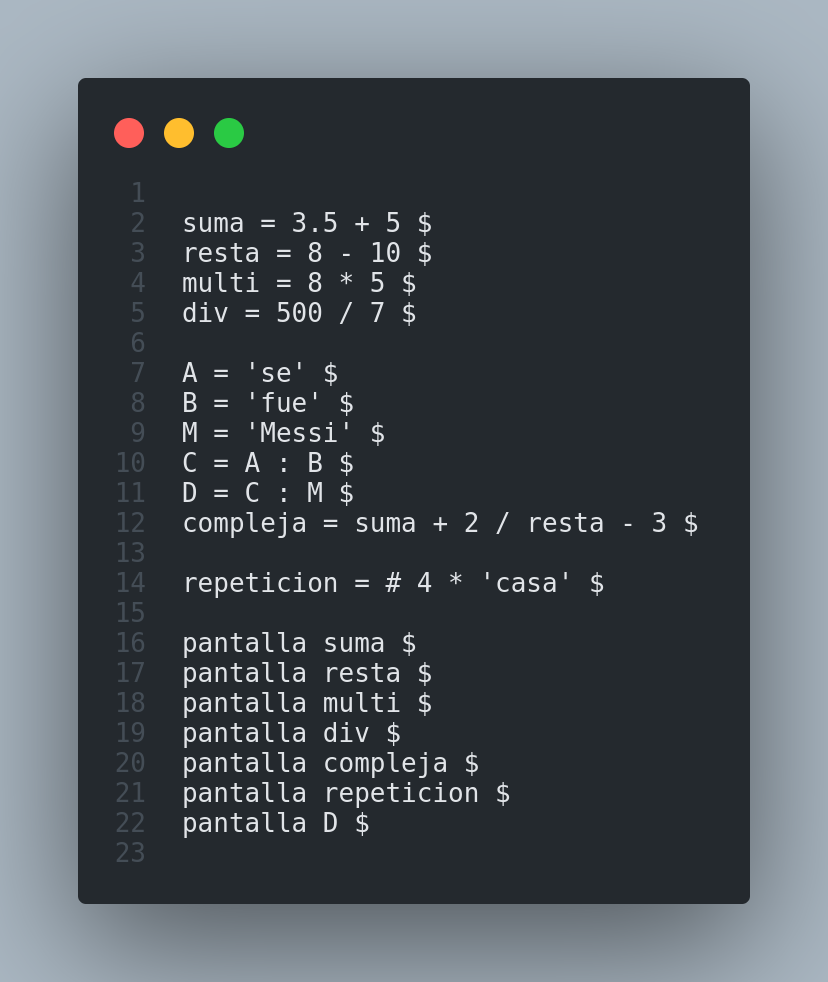
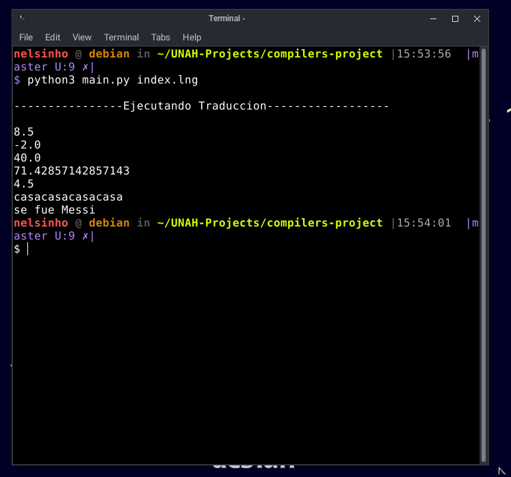
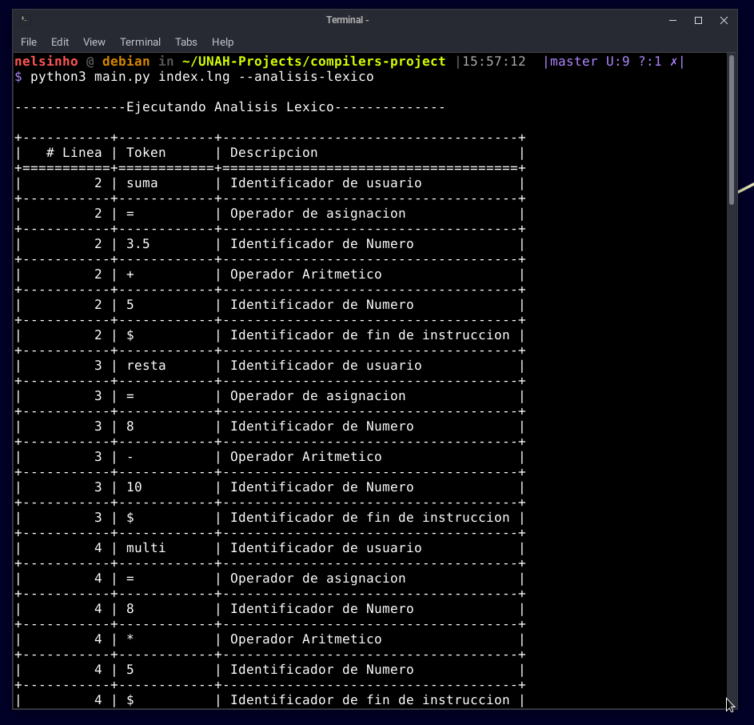
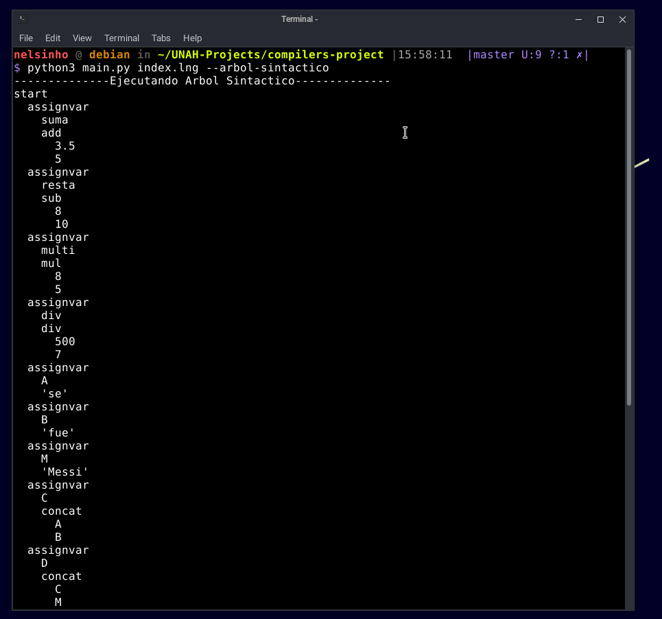

# Documentacion **Traductor Básico** 

- **Asignatura** : IS-913- Diseño de Compiladores 
- **Sección**: 1500 

## **Descripción**
---
Traductor básico el cual recibe una entrada en este caso un archivo con cualquier tipo de extensión y genera una salida según la opción brindada por el usuario del traductor. 

## **Requisitos Previos**
---
1. Tener instalado Python3 
    - https://www.python.org/downloads/
2. Tener instalado Tabulate
    - https://pypi.org/project/tabulate/
3. Tener instalado Lark
    - https://lark-parser.readthedocs.io/en/latest/index.html
    

## **Observación:** 
---
Los comandos utilizados en esta documentación están ejecutados desde Linux, en caso de usar Windows los comandos se utilizan con una leve variación al invocar al intérprete de Python.

Linux | Windows
--- | ---
`python3 nombreDelArchivo` | `py nombredDelArchivo`

## **Funcionamiento**
---
El programa se puede ejecutar cumpliendo tres funciones distintas en las cuales se comprende un **traductor**, un **analizador léxico** y la impresión de un **árbol sintáctico**. 

El archivo que nuestro traductor ejecutara en esta documentación tiene como nombre index.lng y contiene las siguientes instrucciones:

- **Traductor** 
    - **Descripción**: Su funcionamiento es el de un traductor en el cual lee un archivo de texto y retorna la traducción de este código, esta traducción se hace en base a una gramática predefinida. 

    - **Comando** : `python3 main.py index.lng`
    
    - **Resultado**:
    

- **Analizador Léxico** 

    - **Descripción**: Se encarga de mostrar los tokens obtenidos con sus distintos atributos.

    - **Comando** : `python3 main.py index.lng --analisis-lexico`
    
    - **Resultado**:
    

- **Árbol Sintáctico** 

    - **Descripción**: Su funcionamiento consiste en ver visualmente el árbol que se genera para poder traducir el código brindado. 

    - **Comando** : `python3 main.py index.lng --arbol-sintactico`
    
    - **Resultado**:
    

- **Errores**: Al ser un traductor los errores se pueden dar a nivel léxico en caso de que el token ingresado no ese registrado y errores sintácticos-semánticos en caso de que no se pueda realizar dicha instrucción. 